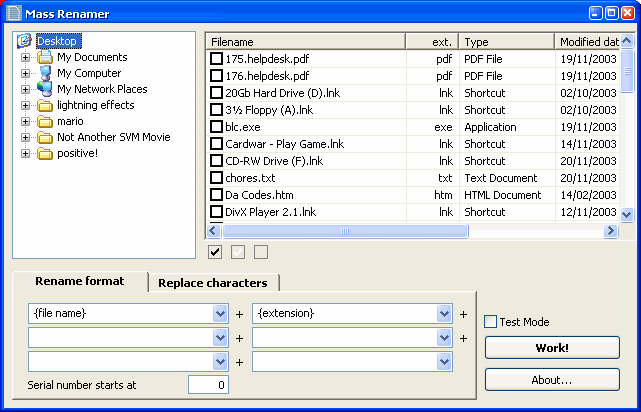

## Mass Renamer \(resubmit\)

### Description

A program that batch renames files in a folder, based on Adobe Photoshop's batch renaming system.
 
### More Info
 
I forgot to mention, the "missing" ocx should be in the Controls directory...

             |
---                |---
**Submitted On**   |2003-12-01 14:31:24
**By**             |[Headdy](https://github.com/Planet-Source-Code/PSCIndex/blob/master/ByAuthor/headdy.md)
**Level**          |Intermediate
**User Rating**    |3.7 (11 globes from 3 users)
**Compatibility**  |VB 6\.0
**Category**       |[Files/ File Controls/ Input/ Output](https://github.com/Planet-Source-Code/PSCIndex/blob/master/ByCategory/files-file-controls-input-output__1-3.md)
**World**          |[Visual Basic](https://github.com/Planet-Source-Code/PSCIndex/blob/master/ByWorld/visual-basic.md)
**Archive File**   |[Mass\_Renam1678611212003\.zip](https://github.com/Planet-Source-Code/headdy-mass-renamer-resubmit__1-50238/archive/master.zip)

